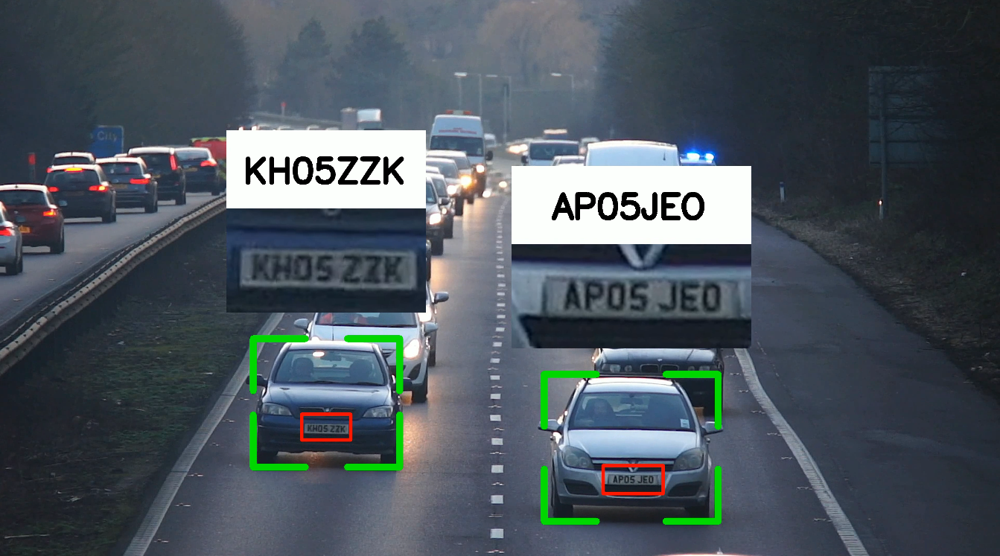
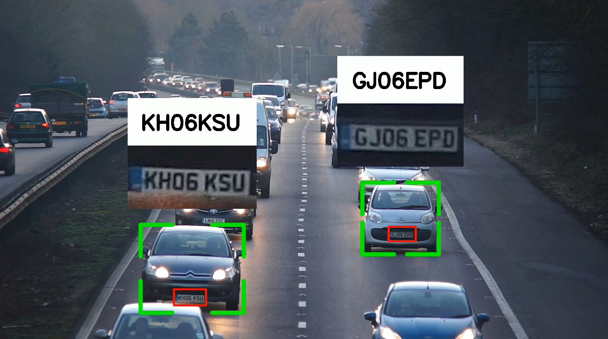

**NB: Only focused on number plates that have 7 digits, eg, KDD 123K**

**Links**

- [Roboflow Dataset](https://universe.roboflow.com/roboflow-universe-projects/license-plate-recognition-rxg4e/dataset/4)
- [GitHub Sort Module](https://github.com/abewley/sort)
- [Trained Model](https://drive.google.com/drive/folders/1fgwHLHDCmJMcfYYkkhc79A1Q2vRPFiPJ?usp=drive_link)

